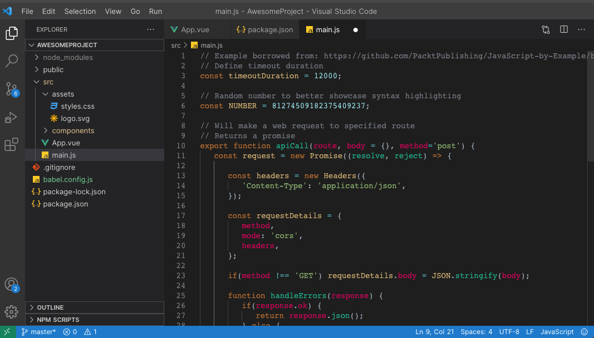

# 🪬 EyeGuard: A Dark, Clean, Minimal VSCode Theme
### ➡️ Elevate your coding experience with a developer-friendly, eye-pleasing theme.

## Installation

- Open the Extensions sidebar in VSCode
- Search for `EyeGuard`
- Click Install
- Open the Command Palette with Ctrl+Shift+P or ⇧⌘P
- Select Preferences: Color Theme and choose `EyeGuard`

---

## About me
- 👨‍💻 I'm a Full-Stack Software Engineer from Dhaka, Bangladesh.
- ✨ Writing at [Abstract Thoughts 🤔](https://imamhossainroni.me/)
- 🐛 Fixing bugs... 😄
- 🏢 I'm currently working remotely as a Full-Stack Software Engineer
- ⚙️ I used: `Python`,  `Django`, `FastAPI`, `Javascript`, `Vue`, `Angular`, `React`
- 🌱 Learning all about **Open Source**
- 💬 Ping me : imamhossainroni95@gmail.com

